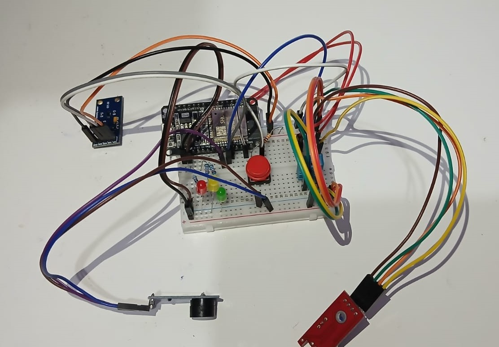

# Monitoramento Ambiental para Biotério

## 📋 Sobre o Projeto
Projeto desenvolvido na 2º unidade da disciplina de Sistemas Embarcados.
Este projeto implementa um sistema de monitoramento ambiental completo para biotérios (salas/racks de criação de ratos), garantindo condições ideais para reprodução animal através do monitoramento em tempo real de parâmetros críticos.

## 🎯 Objetivo
Desenvolver uma solução MVP  que monitore continuamente as condições ambientais e alerte quando parâmetros saírem das faixas estabelecidas, conforme especificado no documento de projeto.

## 📊 Parâmetros Monitorados

### 1. Temperatura
- **Faixa ideal:** 22-26°C

### 2. Umidade Relativa
- **Faixa ideal:** 40-60%

### 3. Luminosidade (Fotoperíodo)
- **Ciclo:** 12h claro / 12h escuro
- **Dia:** 150-300 lux
- **Noite:** ≈0 lux 

### 4. Ruído
- **Limite:** < 70 dB(A)
- **Objetivo:** Minimizar picos sonoros

## ⚙️ Componentes do Sistema




### Sensores Utilizados
1. **BH1750** - Sensor de luminosidade
2. **DHT11** - Sensor de temperatura e umidade
3. **KY-037** - Sensor de som (com módulo LM393)

### Atuadores
- **LEDs tricolor** (Vermelho/Amarelo/Verde) para indicar estado
- **Buzzer** para alertas sonoros
- **Botão** para silenciar temporariamente o buzzer

## 📈 Funcionalidades Principais

### 1. Monitoramento Contínuo
- Leituras a cada 10 segundos
- Médias móveis de 1 minuto para suavização
- Cálculo automático do ciclo dia/noite (12h cada)

### 2. Sistema de Alertas Inteligente
- **LED Verde:** Todas as variáveis dentro da faixa
- **LED Amarelo:** 1 variável fora da faixa por 1-5 minutos
- **LED Vermelho + Buzzer:** 
  - Variável crítica fora por >5 minutos
  - Múltiplas variáveis fora da faixa

### 3. Histerese para Estabilidade
- Alerta dispara após 3 leituras consecutivas fora da faixa
- Retorno a "OK" após 3 leituras consecutivas dentro da faixa

### 4. Estatísticas 24 Horas
- Registro de mínimo, máximo e médias para cada sensor
- Cálculo de porcentagem do tempo fora da faixa para cada sensor
- Captação dos dados na serial e exportação automática em formato CSV

## 📁 Estrutura de Código

### Pinagem
```cpp
// Sensores
#define DHTPIN 19          // DHT11
#define KY037Analog 34     // Sensor de som analógico
#define KY037Digital 35    // Sensor de som digital

// Atuadores
const int redLedPin = 15;
const int greenLedPin = 4;
const int yellowLedPin = 2;
const int buzzerPin = 18;
const int buttonPin = 23;
```

### Intervalos de Tempo
```cpp
#define readingInterval 10000        // 10s entre leituras
#define alertTime 60000              // 1min para alerta amarelo
#define maximumAlertTime 300000       // 5min para alerta vermelho
#define buzzerInterval 30000         // 30s entre toques do buzzer
#define silenceDuration 600000       // 10min sem buzzer após silenciar
```

## 📊 Saída de Dados

### Formato CSV
O sistema gera três tipos de registros CSV:

1. **Leituras Instantâneas** (a cada 10s):
```
leitura,timestamp,SENSOR,valor,,
```

2. **Médias de 1 Minuto** (a cada 60s):
```
media_1min,timestamp,SENSOR,valor_médio,,
```

3. **Resumo de 24 Horas**:
```
resumo_24h,timestamp,SENSOR,min,max,média,%_fora_faixa
```

## 🔧 Configuração

### Limiares Configuráveis
```cpp
#define tempMin 22.0
#define tempMax 26.0
#define humidityMin 40.0
#define humidityMax 60.0
#define soundScoreThreshold 40       // Score médio máximo
#define soundPeakThreshold 60        // Threshold para picos
```

## 🚀 Instalação e Uso

### Requisitos
- Placa Arduino/ESP32 com suporte às bibliotecas
- Bibliotecas: `BH1750.h`, `Wire.h`, `DHT.h`

### Conexões
1. Conectar sensores conforme pinagem definida
2. Conectar LEDs e buzzer aos pinos especificados
3. Alimentar o sistema com fonte adequada

### Inicialização
1. O sistema determina automaticamente o estado inicial (dia/noite)
2. Inicia monitoramento contínuo
3. Começa a gerar logs CSV via Serial (9600 baud)


---
